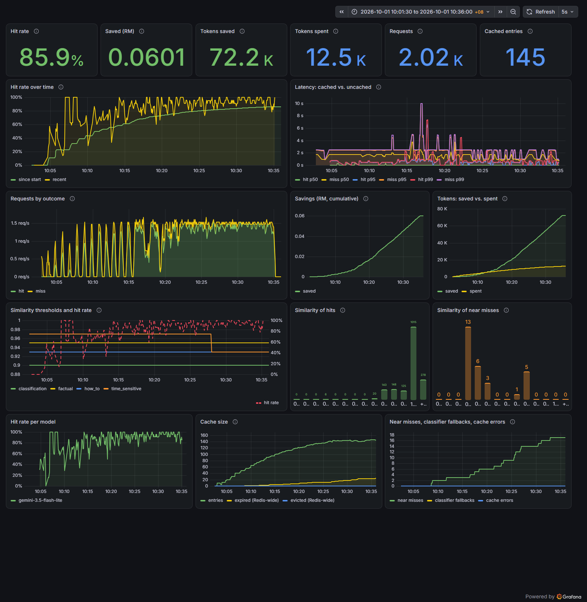
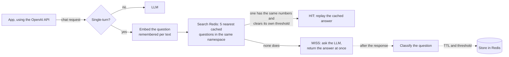

# Semantic Cache for LLMs

A caching proxy for LLM APIs that notices when a question has been asked before **in different words** and serves the earlier answer, so the LLM is called (and paid) once instead of every time. It speaks the OpenAI chat API, so an existing app only changes its base URL.

"What is the capital of Japan?" and "Tell me Japan's capital." have the same answer, but a normal cache sees two different strings. This one compares their **meaning** (embeddings), and decides per type of question how close is close enough, and how long an answer stays fresh.

## Results

A 2,000-request load test of realistic traffic (159 questions in 419 wordings, a few asked constantly and most rarely), run on the Gemini free tier:

| | |
|---|---|
| **Hit rate** | **86.8%**: 1,735 of 2,000 requests answered from the cache. The workload allows at most 87.8% (every question's first appearance must miss), and an exact-match cache could have served at most 75.4%. |
| **LLM tokens saved** | **85.7%** (72,184 of 84,213) |
| **Latency, cached vs. uncached** | p50 **0.05 s vs 1.24 s** (23× faster); p95 0.53 s vs 2.09 s (75% lower) |
| **Wrong answers** | **6 of 1,735 hits (0.3%)** were answered from a different question (see below) |
| **Errors** | 0. Retries absorbed Google's brief errors: 9 rate-limited answers (retried by the client) and 4 classifier calls; no classification fell back to the default policy |
| Embedding calls | 420 instead of 2,000, thanks to the embedding memory |

The hit rate starts at 43% (first 100 requests) and settles at 90–98% once the popular questions are cached. Full report and method: [docs/loadtest-2026-10-01.md](docs/loadtest-2026-10-01.md).



**What the wrong answers showed.** All 6 were the same pair: *"The battery died after two days and support never replied."* matched the cached review *"It stopped working within a week."* at similarity 0.902–0.908, just over the classification threshold of **0.90**. Both reviews are negative, so the answer served was right, but by luck. When the question's *content* decides the answer, 0.90 is too loose. This is what the feedback loop is for, and it worked live during the run: 16 weather near misses were labelled by hand, and the cache learned a time-sensitive threshold of **0.93** (from 0.97) that let same-city rewordings ("weather in London" ↔ "raining in London", 0.954–0.965) hit while still rejecting different cities (≤ 0.92). Weather hits rose from 33% to 65% (small samples).

## How it works



1. **What can be cached:** single-turn requests (one question, optional system prompt). Multi-turn conversations pass straight through (`BYPASS`).
2. **Namespace:** model, system prompt, temperature and `max_tokens` are hashed into a namespace, and answers are only ever reused within the same one.
3. **Embed** the question with `gemini-embedding-001`. Each text's vector is remembered in Redis, so a repeated text costs no API call.
4. **Search** Redis's vector index (HNSW, cosine) for the 5 nearest cached questions. Candidates whose **numbers differ** from the question's are dropped first: to an embedding, "6906006 × 2032032" and "6906006 × 2032033" are nearly the same sentence, as are "the rate in 2005" and "the rate in 2015". Then each remaining entry carries **its own required similarity**, set by the kind of question it was, and the closest entry that clears its own bar is served.
5. **On a miss**, the LLM's answer goes straight back to the user. Only then does a classifier label the question, which sets how long the answer is kept and how similar a future question must be:

   | Question type | Kept for | Required similarity | Example |
   |---|---|---|---|
   | factual | 24 h | 0.95 | "What is the capital of Japan?" |
   | how_to | 1 h | 0.93 | "How do I reverse a list in Python?" |
   | time_sensitive | 5 min | 0.97 | "What's the weather in KL today?" |
   | classification | 24 h | 0.90 | "Is this review positive or negative?" |
   | creative | never cached | | "Write a poem about rain." |

6. **Learn from feedback:** every lookup is logged with its closest match. People label hits and near misses as right or wrong, and once a question type has 10 labels, its threshold is re-learned (see [Tuning thresholds](#tuning-thresholds-near-misses-feedback-and-learning)).

The stack: **FastAPI** (Python 3.13, `uv`), **Redis Stack** (vector search via RedisVL), **Gemini** (`google-genai`), **Prometheus** and **Grafana**, all in **Docker Compose**.

## Design decisions

* **The similarity threshold belongs to the cached entry, not the request.** A factual answer can be reused for a question at 0.95; a weather report needs 0.97, because "weather in Tokyo" and "weather in Toronto" have a similarity of 0.92 but different answers. Searching the 5 nearest entries (not just 1) lets a looser entry be found behind a stricter one that's slightly closer.
* **The user never waits for the classifier.** It runs alongside the LLM and finishes after the response is sent, so even a slow classifier model adds no latency. If it fails, the answer is cached with the default policy; brief Google errors (429 / 5xx) are retried first.
* **The cache is an optimisation, never a dependency.** If Redis or the embedding API fails, the request goes to the LLM (`X-Cache-Bypass-Reason: cache-error`). LLM errors keep their meaning: 429 and 503 pass through so clients retry.
* **Only complete answers are cached.** An answer cut off (`length`, `content_filter`), or a stream the client abandoned, is never stored, so nobody is served half an answer.
* **Embeddings are remembered, not answers guessed.** Re-embedding identical text returns an identical vector, so remembering it changes no result and saves quota (the load test made 420 embedding calls for 2,000 requests).
* **Similarity is not the only test.** A threshold can't separate two questions that differ by one digit (they score about 0.99), so numbers are compared exactly, by value, before similarity is considered. It costs no API call, and `cache_number_blocks` in `/v1/analytics` counts the wrong answers it stopped. Numbers written as words count too, in English and Malay ("fifteen" = "lima belas" = 15, "5 million" = 5000000). Anything not recognised (ordinals like "third", "half", "5k") makes the pair look different, which can cost a hit but never serves a wrong answer.
* **Tried, measured, removed.** Cleaning the question before embedding it (lower case, no polite openers) sounded like a free win. A 2,000-request run showed the opposite: it lowered similarity between wordings and cost 22 hits, so the question is embedded exactly as asked again. [docs/loadtest-2026-10-06.md](docs/loadtest-2026-10-06.md).
* **Learned thresholds have guardrails.** They need 10 labels, 95% precision and 5 labels of support, never go below the lowest similarity anyone has judged, and stay within 0.90–0.99.
* **Measured, not assumed.** The load test's workload knows which wordings are the same question, and the server logs which cached question served each hit, so wrong answers are counted exactly, not estimated.

## Limitations and next steps

* **Raise the classification threshold** (or label hits): at 0.90, different reviews in the same template match (above).
* **The classifier costs tokens on every miss:** about 250 per call, on a separate model and quota. This workload's answers are deliberately short (one or two sentences), so here the classifier used more tokens than the answers did; with typical answers of several hundred tokens it's a small fraction. A shorter prompt, or reusing the classification of a near-identical cached question, would cut it.
* **Single-turn only.** Caching multi-turn conversations needs a key that covers the history.
* **Metrics are per process.** Running several workers needs Prometheus multiprocess mode (see the note at the end).
* **The load test was paced for the free tier** (12 LLM calls a minute), so its duration isn't a throughput benchmark.

## Run the whole stack

One command starts the cache, Redis, Prometheus and Grafana, each in its own container:

```sh
cp .env.example .env        # then set GEMINI_API_KEY in .env
docker compose up -d --build
```

| Open | What it is |
|---|---|
| http://localhost:8000 | The cache: API and [playground](#playground) |
| http://localhost:3000 | Grafana, opening on the **Semantic Cache** dashboard (no login needed to view; `admin` / `admin` to edit) |
| http://localhost:9090 | Prometheus, which collects the app's metrics every 5 seconds |

The dashboard shows the hit rate as the cache fills, money (RM) and tokens saved, latency for cached vs. uncached requests (p50 / p95 / p99), requests by outcome, how similar hits and near misses were, the similarity thresholds in use against the hit rate, and cache size. It's generated by `monitoring/grafana/build_dashboard.py`; change a panel there, re-run it, and restart Grafana (`docker compose restart grafana`).

If a port is already in use, change it: `REDIS_PORT=6380 APP_PORT=8001 GRAFANA_PORT=3001 PROMETHEUS_PORT=9091 docker compose up -d --build`. Stop everything with `docker compose down` (add `-v` to also delete the cached data and metric history).

## Load test

`loadtest/` sends a realistic stream of questions through the cache and measures what it saved:

```sh
uv run python -m loadtest.run --requests 2000 --dry-run      # describe the run and estimate its cost; sends nothing
uv run python -m loadtest.run --requests 2000 --clear-cache  # run it against an empty cache
```

* **The workload** (`loadtest/workload.py`) is 159 different questions, each with several wordings. A few are asked constantly and most rarely (a Zipf "long tail"), as in real traffic. It includes creative requests, which are never cached, and time-sensitive ones, which are cached only briefly. The same `--seed` always gives the same requests.
* **The runner** sends `--concurrency` requests at a time, no faster than `--rps` per second, and backs off and retries when the LLM is overloaded or rate-limited (429 / 502 / 503).
* **Rate limits and quotas:** `--llm-rpm 12` keeps LLM calls under a per-minute limit, and `--llm-budget 450` stops the run cleanly before it makes more LLM calls than that (for a daily quota); the report then covers the requests completed. Only misses call the LLM, twice each (the answer and the classifier), so the run speeds up as the cache fills. Staying under the limit matters for correctness, not only speed: a rate-limited classifier falls back to the default policy.
* **The report** (`loadtest/results/<timestamp>/report.md`) gives the hit rate and how it climbs as the cache fills, latency percentiles for hits and misses, tokens and RM saved, and **wrong answers**: hits answered from a different question's cache entry. The workload knows which wordings are the same question, and after the run the load test asks the server which cached question served each hit (`GET /v1/cache/lookups/{id}`), so every hit is checked exactly.

Watch the Grafana dashboard while it runs.

**On the Gemini free tier**, each model has its own daily quota, so give the classifier a different model from the answers. In `.env`:

```sh
CLASSIFIER_MODEL=gemini-3.1-flash-lite   # its own 15/min, 500/day, separate from gemini-3.5-flash-lite
```

Then each miss makes one call to each model, and you can pace and cap the run:

```sh
uv run python -m loadtest.run --requests 2000 --clear-cache --rps 1.5     --llm-rpm 12 --llm-calls-per-miss 1 --llm-budget 470
```

The embedding memory means the 2,000 requests need only ~419 embedding calls (one per distinct wording). Run it right after your daily quota resets (midnight Pacific time) for the whole day's allowance. This is how the [results](#results) above were measured.

The classifier can also run on a **Gemma** model (`CLASSIFIER_MODEL=gemma-4-26b-a4b-it`), which has a much larger free quota. The classifier supports Gemma's plain-text replies. In testing, though, about half of Gemma's calls failed with Google `500` errors; each failure falls back to the default policy.

## Playground

Start the server (see [Development](#development)) and open **http://localhost:8000**. The playground lets you try the cache by hand:

* **Ask** questions and see each response's `HIT` / `MISS` / `BYPASS` status, similarity, latency and tokens. With **Stream** ticked, the answer appears as it's generated, and the time to the first word is shown. The example buttons include a reworded question, to show a semantic hit, and a poem, which is never cached.
* **Totals** since the server started: hit rate, tokens spent and saved, and money saved (RM).
* **Feedback:** on a `HIT`, say whether the cached answer was right.
* **Near misses:** questions that almost matched a cached one. Mark each as *Same question* or *Different*.
* **Threshold tuner:** hit rate vs. wrong-answer rate at each threshold, and the threshold each question type uses now.
* **Invalidate** entries by model, tag, tag prefix or system prompt, with a preview before deleting.
* **Cached entries**, newest first, with their tags, hit counts, required similarity and expiry. This list is admin-only, like invalidation: if the server sets `ADMIN_TOKEN`, enter it under *Invalidate* (it's saved in your browser only).

The page only calls the public API, so what it shows is exactly what any client would see.

## Streaming

Send `"stream": true` and the answer arrives as Server-Sent Events in OpenAI's format (`chat.completion.chunk` events, then `data: [DONE]`). Add `"stream_options": {"include_usage": true}` to get token counts in a final event. The cache headers (`X-Cache-Status` and friends) are on the response as usual.

| Outcome | What is streamed | Cached? |
|---|---|---|
| **HIT** | The cached answer, sent at once (no LLM call) | Already is |
| **MISS** | The LLM's answer, passed through as it's generated | Only if it finishes normally (`finish_reason: "stop"`) |
| **BYPASS** | The LLM's answer, passed through | Never |

A streamed answer is **not** cached if the client disconnects before it ends, if it's cut off (`length`, `content_filter`), or if the LLM fails partway. A partial answer is never served to anyone else. An answer cached from a streamed request is served to later requests whether or not they stream.

## When the LLM fails

LLM failures are reported as such, not as a generic 500:

* Overloaded or rate-limited (`503` / `429` from the provider) keeps that status, so clients know to retry.
* Any other provider failure is a `502`.
* While streaming, a failure **before** the first word is a normal HTTP error like the above. **After** that, the `200` status is already sent, so the stream ends with an error event instead of `[DONE]`: `data: {"error": {"message": "...", "type": "upstream_error"}}`.

## Endpoints

* **`POST /v1/chat/completions`**: OpenAI-compatible endpoint. Drops into existing applications effortlessly. Every response has an `X-Cache-Status` header (`HIT`, `MISS`, or `BYPASS`), plus `X-Cache-Similarity` on hits, `X-Cache-Bypass-Reason` (`uncacheable` or `cache-error`) on bypasses, and `X-Cache-Lookup-Id` (for feedback) on hits and misses. Cache hits replay the original answer's `usage` and `finish_reason`. Supports `"stream": true` (see [Streaming](#streaming)).
* **`GET /v1/models`**: The models to choose from, in OpenAI's format (Gemini's, plus the second provider's when one is configured).
* **`GET /v1/analytics`**: JSON dashboard showing hit rates, tokens spent and saved, money saved (RM), and classifier performance. (Note: metrics reset on process restart).
* **`GET /metrics`**: Prometheus-formatted metrics (counters, request duration histograms, similarity score histograms, live cache sizes, tokens and money saved).
* **`GET /v1/cache/stats`**: Live Redis store stats (entry count, plus Redis-wide evicted/expired key counters).
* **`POST /v1/cache/invalidate`**: Delete cached entries by model, system prompt, or tag (see below).
* **`GET /v1/cache/entries?limit=50`**: The most recently cached entries, newest first (admin-only, like invalidation).
* **`POST /v1/cache/feedback`**, **`GET /v1/cache/near-misses`**, **`GET /v1/cache/tuner`**, **`GET /v1/cache/thresholds`**: threshold tuning (see below). Feedback and near misses are admin-only.
* **`GET /v1/cache/lookups/{id}`** (admin): one lookup, by its `X-Cache-Lookup-Id`. On a hit, `candidate_prompt` is the cached question whose answer was served. The load test uses it to count wrong answers exactly.
* **`GET /playground`** (and `/`, which redirects there): the web playground.

## Cache invalidation

Changing a system prompt, model, temperature or `max_tokens` already puts requests in a new cache namespace, so outdated entries can't be *served*. They just wait for their TTL to expire. Invalidation is for when the **answers** go stale while the requests stay the same: a model upgraded behind the same name, facts that changed (prices, policies), or a feature you want to reset. It also frees memory.

Label entries by sending an `X-Cache-Tags` header with chat requests (comma-separated; letters, digits, `_ . : -`; up to 10; case-insensitive). Tags group entries for invalidation; they don't split the cache.

```sh
curl localhost:8000/v1/chat/completions -H "X-Cache-Tags: pricing, shop:v2" -d '{...}'
```

Then invalidate with any combination of filters (combined with AND):

| Body | Clears |
|---|---|
| `{"model": "gemini-3.5-flash"}` | Everything that model generated |
| `{"system_prompt": "You are a support agent."}` | Everything for that exact system prompt, across all models and parameters (`""` = requests without one) |
| `{"system_prompt_hash": "7ec53d266067f78f"}` | The same, by the prompt's 16-char hash |
| `{"tag": "pricing"}` | Entries with that tag |
| `{"tag_prefix": "shop:"}` | Entries with a tag starting with `shop:` |
| `{"all": true}` | The whole cache (can't be combined with filters) |

Add `"dry_run": true` to see how many entries match without deleting. An empty body is rejected, so a missing filter can never wipe the cache.

Set `ADMIN_TOKEN` to require `Authorization: Bearer <token>` on this endpoint. It's open when unset (fine on localhost), and the server logs a warning at startup.

Entries cached before this feature have no system prompt hash or tags, so they can only be cleared by `model` or `all` (or they expire within 24 hours). When the app starts against an older index, it rebuilds the index definition automatically and keeps every cached entry.

## Embedding memory

Every lookup starts by embedding the question, which is a call to the Gemini Embedding API. The same text often comes back (the load test's 2,000 requests contain only 419 different wordings), and embedding it again returns exactly the same vector. So the app remembers each text's embedding in Redis (`semcache:embedding:*`, keyed by model, dimensions and exact text) and calls the API only for text it hasn't seen.

* **Saves quota and time.** Repeated text makes no embedding call, which matters on the free tier (1,000 embedding calls a day), and those requests skip ~0.3 s of API latency.
* **Changes no results.** A remembered vector is bit-for-bit the one the API would return, so hits and misses are exactly as before. Reworded questions are new text and are embedded as usual.
* **Safe.** Different models or dimensions never share vectors; entries expire after `EMBEDDING_CACHE_TTL_SECONDS` (7 days; `0` turns the memory off; about 3 KB per text); and if Redis fails, the text is embedded by the API.

`/v1/analytics` reports `embeddings.api_calls` and `embeddings.remembered`, and Prometheus `semcache_embedding_cache_hits_total`.

## Tuning thresholds: near misses, feedback, and learning

How similar must two questions be to share an answer? Too loose and people get wrong answers; too strict and the cache rarely hits. The cache learns the answer from feedback:

1. **Every cacheable request is logged** (in Redis, the most recent 5,000) with the closest cached question and their similarity: a **hit**, a **near miss** (similar, but below the threshold), or a **miss** (nothing similar). Responses carry the log id in `X-Cache-Lookup-Id`.
2. **People label lookups** with `POST /v1/cache/feedback {"lookup_id": "...", "good_match": true|false}`: for a hit, *was the cached answer right?*; for a near miss, *would it have been right?* Labelled lookups are kept permanently as training data.
3. **The near-miss analyzer** (`GET /v1/cache/near-misses`) lists lookups that almost matched, to label and to spot phrasings the cache is missing.
4. **The threshold tuner** (`GET /v1/cache/tuner?intent=factual`) shows, for each threshold from 0.90 to 1.00, how many recent lookups would have hit and how many of those were labelled wrong.
5. **Learned thresholds** (`GET /v1/cache/thresholds`): once a question type (factual, how_to, …) has **10 labels**, it uses the **lowest** threshold where at least **95%** of labelled matches were right, with at least 5 labels at or above it. It never goes below the lowest similarity anyone has judged, and stays within 0.90–0.99. Lookups use it immediately, including for entries already in the cache.

## Savings (in Malaysian ringgit)

The one money figure is **what cache hits saved**, in **MYR**. Everything else is counted in tokens: `/v1/analytics` reports `tokens.spent` (LLM tokens actually used) and `tokens.saved` (LLM tokens avoided by hits).

* **Savings are exact per hit:** each hit is credited with the tokens its cached answer originally used, priced by that answer's model.
* Model prices live in `PRICING_TABLE` (`src/semcache/config.py`) in USD per million tokens, as providers publish them, and are converted with its `usd_to_myr` rate. Update the rate and its `usd_to_myr_as_of` date along with the prices.
* Hits on models missing from `PRICING_TABLE` are never priced as another model. `/v1/analytics` lists them under `savings.unpriced_models`.

## Monitoring queries (PromQL)

The Grafana dashboard (see [Run the whole stack](#run-the-whole-stack)) already charts these. The queries behind it, for your own panels or alerts:

```promql
# Hit rate per model (last 5 min)
sum by (model) (rate(semcache_request_duration_seconds_count{cache_status="hit"}[5m]))
  / sum by (model) (rate(semcache_request_duration_seconds_count[5m]))

# Money saved per hour, in MYR
increase(semcache_cost_saved_myr_total[1h])

# P95 latency, cached vs. uncached
histogram_quantile(0.95, sum by (le, cache_status) (rate(semcache_request_duration_seconds_bucket[5m])))
```

## Using models from another provider (optional)

Gemini is the default. To also answer with models from **any service that has an OpenAI-style API** (OpenAI itself, or a host that serves open models such as Mistral, Qwen or gpt-oss behind one address and one key), set two values in `.env` and restart:

```bash
OPENAI_COMPATIBLE_API_KEY=your-key
OPENAI_COMPATIBLE_BASE_URL=https://host.example/v1   # the provider's "base URL"; OpenAI's own if unset
```

Then choose the model per request by its name, exactly as the provider lists it:

```bash
curl http://localhost:8000/v1/chat/completions -H "Content-Type: application/json" \
  -d '{"model": "openai-gpt-oss-120b", "messages": [{"role": "user", "content": "What is the capital of Malaysia?"}]}'
```

* **Routing is by model name:** names starting with `gemini` or `gemma` go to Gemini; every other name goes to the second provider. One key serves all of that provider's models.
* **The cache works the same way** for both. The model name is part of every cache key, so one model's answer is never served for another.
* **Embeddings and the intent classifier stay on Gemini**, so `GEMINI_API_KEY` is still required.
* **The model list** is at `GET /v1/models` (the same shape as OpenAI's), and fills the playground's Model dropdown: the Gemini models plus the chat models the second provider reports. Any other name can still be requested; in the playground choose "Other".
* **Cost figures need prices.** A model without a price still works and still counts tokens saved, but it has no cost in Langfuse and its hits are listed under `savings.unpriced_models` instead of being priced. Give it one in `.env`, in USD per million tokens:

  ```bash
  EXTRA_MODEL_PRICES={"openai-gpt-oss-120b": {"input": 0.15, "output": 0.60}}
  ```

  If the provider doesn't charge per token (a university or company host, say), this is a reference price you choose, such as what a commercial host charges for the same model, so say so wherever you quote the savings.
* Thinking models' reasoning is not returned or cached, only the answer.

## Tracing single requests with Langfuse (optional)

Grafana shows totals. To see **one request** step by step, turn on [Langfuse](https://langfuse.com) tracing: set both keys in `.env` and restart.

```bash
LANGFUSE_PUBLIC_KEY=pk-lf-...
LANGFUSE_SECRET_KEY=sk-lf-...
# LANGFUSE_BASE_URL=...   # Langfuse Cloud by default; set it for another region or a self-hosted server
```

Each request then becomes a trace:

```
chat-completion            the question, the answer, and cache_status (hit / miss / bypass)
├─ cache-lookup            hit or miss, and the lookup id
│  ├─ embedding            only when the embedding API was called (not when the embedding was remembered)
│  └─ vector-search        every candidate: the cached question, its similarity, and the similarity it needed
├─ classify-intent         on a miss: the question type the classifier chose
├─ llm-generation          on a miss or bypass: the LLM call, its tokens, and time to first word
└─ store-answer            on a miss: whether the answer was cached, with which TTL and threshold
```

* **Why a request hit or missed** is in `vector-search`: it lists what the question was compared with and how close each candidate came.
* **Cost shows on the LLM step** for every model that has a price here (the built-in Gemini prices, or `EXTRA_MODEL_PRICES`), in USD, so Langfuse and `/v1/analytics` agree. A cache hit has no LLM step and so no cost: that is the saving.
* **Feedback shows on the trace.** `POST /v1/cache/feedback` also adds a `good_match` score to the trace of the request it judges.
* **Off unless both keys are set.** Without them nothing is recorded or sent, and the request path is unchanged.
* **It can't fail a request.** Traces are sent in the background; if Langfuse is unreachable the error is logged and the request is served as usual.
* **Privacy:** with tracing on, questions and answers are sent to the Langfuse server you configured.
* Self-hosting Langfuse? Its default port is 3000, the same as Grafana here, so run one of them on another port.

## Development

1. Start only Redis Stack (Redis plus the RediSearch module needed for vector search):
   `docker compose up -d redis` (set `REDIS_PORT` to use a port other than 6379, and update `REDIS_URL` to match)
2. Copy `.env.example` to `.env` and set `GEMINI_API_KEY`.
3. Run the server with `uv run semcache`. The default configuration uses `reload=True`.

Run the unit tests with `uv run pytest -m "not integration"`. They need neither Redis nor an API key.
The integration tests (`uv run pytest -m integration`) need Redis on `localhost:6379`. **They flush that Redis database**, so they erase any cached entries in it. To keep your dev cache, run them against a separate Redis instead:

```sh
REDIS_PORT=6390 docker compose -p semcache-test up -d redis
SEMCACHE_TEST_REDIS_URL=redis://localhost:6390 uv run pytest -m integration
docker compose -p semcache-test down -v
```

> **Note on Prometheus Metrics in Production**:
> The metrics counters and Prometheus exposition in this project are currently designed for a single-process server.
> If you run `uvicorn` with multiple workers (e.g., `--workers 4`), the metrics will be per-process. To aggregate metrics across multiple workers, you must configure Prometheus Client's multiprocess mode (setting `PROMETHEUS_MULTIPROC_DIR`). This matters as soon as you deploy without `reload=True` and scale up the workers.
